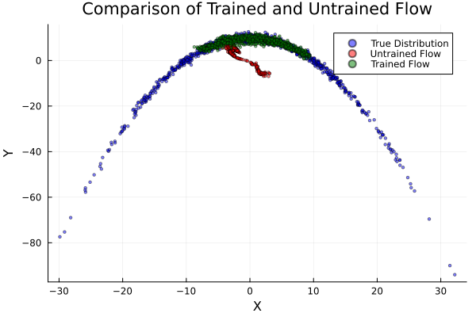

# Planar Flow on a 2D Banana Distribution

This example demonstrates learning a synthetic 2D banana distribution with a planar normalizing flow [^RM2015] by maximizing the Evidence Lower BOund (ELBO).

The two required ingredients are:

- A log-density function `logp` for the target distribution.
- A parametrised invertible transformation (the planar flow) applied to a simple base distribution.

## Target Distribution

The banana target used here is defined in `example/targets/banana.jl` (see source for details):

```julia
using Random, Distributions
Random.seed!(123)

target = Banana(2, 1.0, 10.0)  # (dimension, nonlinearity, scale)
logp = Base.Fix1(logpdf, target)
```

You can visualise its contour and samples (figure shipped as `banana.png`).


## Planar Flow

A planar flow of length N applies a sequence of planar layers to a base distribution q₀:

```math
T_{n,\theta_n}(x) = x + u_n \tanh(w_n^T x + b_n), \qquad n = 1,\ldots,N.
```

Parameters θₙ = (uₙ, wₙ, bₙ) are learned. `Bijectors.jl` provides `PlanarLayer`.

```julia
using Bijectors
using Functors # for @leaf

function create_planar_flow(n_layers::Int, q₀)
    d = length(q₀)
    Ls = [PlanarLayer(d) for _ in 1:n_layers]
    ts = reduce(∘, Ls)  # alternatively: FunctionChains.fchain(Ls)
    return transformed(q₀, ts)
end

@leaf MvNormal  # prevent updating base distribution parameters
q₀ = MvNormal(zeros(2), ones(2))
flow = create_planar_flow(10, q₀)
flow_untrained = deepcopy(flow)  # keep copy for comparison
```

If you build *many* layers (e.g. > ~30) you may reduce compilation time by using `FunctionChains.jl`:

```julia
# uncomment the following lines to use FunctionChains
# using FunctionChains
# ts = fchain([PlanarLayer(d) for _ in 1:n_layers])
```
See [this comment](https://github.com/TuringLang/NormalizingFlows.jl/blob/8f4371d48228adf368d851e221af076ff929f1cf/src/NormalizingFlows.jl#L52)
for how the compilation time might be a concern.

## Training the Flow

We maximize the ELBO (here using the minibatch estimator `elbo_batch`) with the generic `train_flow` interface.

```julia
using NormalizingFlows
using ADTypes, Optimisers
using Mooncake

sample_per_iter = 32
adtype = ADTypes.AutoMooncake(; config=Mooncake.Config())  # try AutoZygote() / AutoForwardDiff() / etc.
# optional: callback function to track the batch size per iteration and the AD backend used 
cb(iter, opt_stats, re, θ) = (sample_per_iter=sample_per_iter, ad=adtype)
# optional: defined stopping criteria when the gradient norm is less than 1e-3
checkconv(iter, stat, re, θ, st) = stat.gradient_norm < 1e-3

flow_trained, stats, _ = train_flow(
    elbo_batch,
    flow,
    logp,
    sample_per_iter;
    max_iters = 20_000,
    optimiser = Optimisers.Adam(1e-2),
    ADbackend = adtype,
    callback = cb,
    hasconverged = checkconv,
    show_progress = false,
)

losses = map(x -> x.loss, stats)
```

Plot the losses (negative ELBO):

```julia
using Plots
plot(losses; xlabel = "iteration", ylabel = "negative ELBO", label = "", lw = 2)
```


## Evaluating the Trained Flow

The trained flow is a `Bijectors.TransformedDistribution`, so we can call `rand` to draw iid samples and call `logpdf` to evaluate the log-density function of the flow.
See [documentation of `Bijectors.jl`](https://turinglang.org/Bijectors.jl/dev/distributions/) for details.
```julia
n_samples = 1_000
samples_trained   = rand(flow_trained, n_samples)
samples_untrained = rand(flow_untrained, n_samples)
samples_true      = rand(target, n_samples)
```

Simple visual comparison:

```julia
using Plots
scatter(samples_true[1, :], samples_true[2, :]; label="Target", ms=2, alpha=0.5)
scatter!(samples_untrained[1, :], samples_untrained[2, :]; label="Untrained", ms=2, alpha=0.5)
scatter!(samples_trained[1, :],  samples_trained[2, :];  label="Trained", ms=2, alpha=0.5)
plot!(title = "Planar Flow: Before vs After Training", xlabel = "x₁", ylabel = "x₂", legend = :topleft)
```



## Notes

- Use `elbo` instead of `elbo_batch` for a single-sample estimator.
- Switch AD backends by changing `adtype` (see `ADTypes.jl`).
- Marking the base distribution with `@leaf` prevents its parameters from being updated during training.

## Reference

[^RM2015]: Rezende, D. & Mohamed, S. (2015). Variational Inference with Normalizing Flows. ICML.
