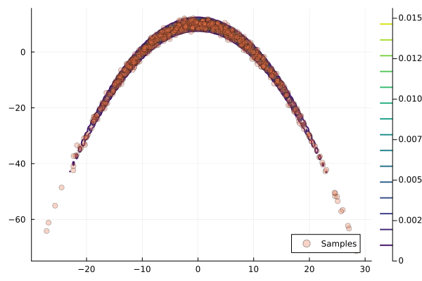
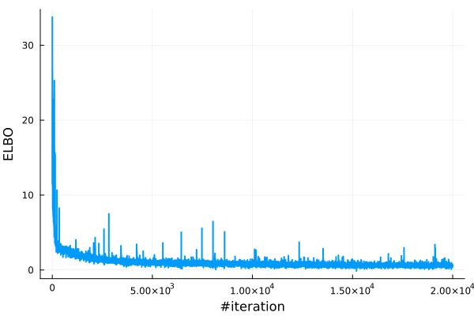

## Example: Using Planar Flow

Here we provide a minimal demonstration of learning a synthetic 2D banana distribution
using planar flows (Rezende and Mohamed, 2015) by maximizing the ELBO.
To complete this task, the two key inputs are:
- the log-density function of the target distribution, 
- the planar flow. 

- the log-density function of the target distribution
- the planar flow

### The Target Distribution

The `Banana` object is defined in `example/targets/banana.jl` (see the source for details).

```julia
p = Banana(2, 1.0f-1, 100.0f0)
logp = Base.Fix1(logpdf, p)
```

Visualize the contour of the log-density and the sample scatters of the target distribution:



### The Planar Flow

The planar flow is defined by repeatedly applying a sequence of invertible
transformations to a base distribution $q_0$. The building blocks for a planar flow
of length $N$ are the following invertible transformations, called planar layers:

```math
T_{n, \theta_n}(x)=x+u_n \cdot \tanh \left(w_n^T x+b_n\right), \quad n=1, \ldots, N.
```

Here $\theta_n = (u_n, w_n, b_n), n=1, \dots, N$ are the parameters to be learned.
[`Bijectors.jl`](https://github.com/TuringLang/Bijectors.jl) provides `PlanarLayer()`.
Below is a 20-layer planar flow on a 2D standard Gaussian base distribution.

```julia
using Bijectors, FunctionChains
using Functors

function create_planar_flow(n_layers::Int, q₀)
    d = length(q₀)
    Ls = [f32(PlanarLayer(d)) for _ in 1:n_layers]
    ts = fchain(Ls)
    return transformed(q₀, ts)
end

# create a 20-layer planar flow
@leaf MvNormal # to prevent params in q₀ from being optimized
q₀ = MvNormal(zeros(Float32, 2), I)
flow = create_planar_flow(20, q₀)
flow_untrained = deepcopy(flow) # keep a copy of the untrained flow for comparison
```

Notice: Using `fchain` (FunctionChains.jl) reduces compilation time versus chaining with `∘` for many layers.

```julia
ts = reduce(∘, [f32(PlanarLayer(d)) for i in 1:20]) 
```
*However, we recommend using `fchain` to reduce the compilation time when the number of layers is large.
See [this comment](https://github.com/TuringLang/NormalizingFlows.jl/blob/8f4371d48228adf368d851e221af076ff929f1cf/src/NormalizingFlows.jl#L52)
for how the compilation time might be a concern.*


#### Flow Training
Then we can train the flow by maximizing the ELBO using the [`train_flow`](@ref) function as follows: 
```julia
using NormalizingFlows
using ADTypes
using Optimisers

sample_per_iter = 10
# callback function to track the number of samples used per iteration
cb(iter, opt_stats, re, θ) = (sample_per_iter=sample_per_iter,)
# defined stopping criteria when the gradient norm is less than 1e-3
checkconv(iter, stat, re, θ, st) = stat.gradient_norm < 1e-3
flow_trained, stats, _ = train_flow(
    elbo,
    flow,
    logp,
    sample_per_iter;
    max_iters=200_00,
    optimiser=Optimisers.ADAM(),
    callback=cb,
    hasconverged=checkconv,
    ADbackend=AutoZygote(), # using Zygote as the AD backend
)
```

Examine the loss values during training:
```julia
using Plots

losses = map(x -> x.loss, stats)
plot(losses; xlabel = "#iteration", ylabel= "negative ELBO", label="", linewidth=2) 
```


## Evaluating Trained Flow 
Finally, we can evaluate the trained flow by sampling from it and compare it with the target distribution.
Since the flow is defined as a `Bijectors.TransformedDistribution`, one can
easily sample from it using `rand` function, or examine the density using `logpdf` function.
See [documentation of `Bijectors.jl`](https://turinglang.org/Bijectors.jl/dev/distributions/) for details.
```julia
using Random, Distributions

nsample = 1000
samples_trained = rand(flow_trained, n_samples) # 1000 iid samples from the trained flow 
samples_untrained = rand(flow_untrained, n_samples) # 1000 iid samples from the untrained flow
samples_true = rand(p, n_samples) # 1000 iid samples from the target

# plot 
scatter(samples_true[1, :], samples_true[2, :]; label="True Distribution", color=:blue, markersize=2, alpha=0.5)
scatter!(samples_untrained[1, :], samples_untrained[2, :]; label="Untrained Flow", color=:red, markersize=2, alpha=0.5)
scatter!(samples_trained[1, :], samples_trained[2, :]; label="Trained Flow", color=:green, markersize=2, alpha=0.5)
plot!(title = "Comparison of Trained and Untrained Flow", xlabel = "X", ylabel= "Y", legend=:topleft) 
```


## Reference 

- Rezende, D. and Mohamed, S., 2015. *Variational inference with normalizing flows*. International Conference on Machine Learning  
