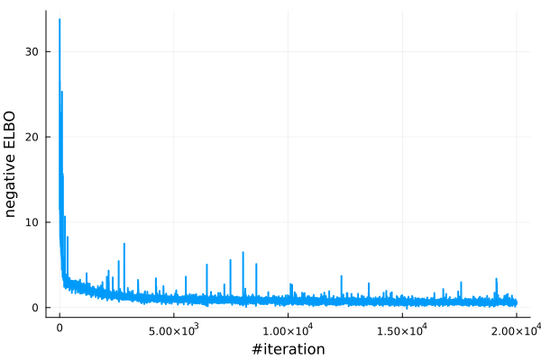

A simple example of learning 2d banana distribution using Planar flows [1]

[1]


```julia
# create 2d banana as target distribution
p = Banana(2, 1.0f-1, 100.0f0)
logp = Base.Fix1(logpdf, p)
```
Visualize the target distribution:


Create a 20-layer planar flow using `PlanarLayer()` from `Bijectors.jl`. 
The flow layers are chained together using `fchain` from `FunctionChains.jl`. 
```julia
using Bijectors, FunctionChains

function create_planar_flow(n_layers::Int, q₀)
    d = length(q₀)
    Ls = [f32(PlanarLayer(d)) for _ in 1:n_layers]
    ts = fchain(Ls)
    return transformed(q₀, ts)
end

# create a 20-layer planar flow
flow = create_planar_flow(20, MvNormal(zeros(Float32, 2), I))
flow_untrained = deepcopy(flow) # keep a copy of the untrained flow for comparison
```


Train the flow

```julia
using NormalizingFlows
using ADTypes
using Optimisers

# train the flow
sample_per_iter = 10
# callback function to track the number of samples used per each iteration
cb(iter, opt_stats, re, θ) = (sample_per_iter=sample_per_iter,)
# defined stopping criteria when the gradient norm is less than 1e-3
checkconv(iter, stat, re, θ, st) = stat.gradient_norm < 1e-3
flow_trained, stats, _ = train_flow(
    elbo,
    flow,
    logp,
    sample_per_iter;
    max_iters=200_00,
    optimiser=Optimisers.ADAM(),
    callback=cb,
    hasconverged=checkconv,
    ADbackend=AutoZygote(), # using Zygote as the AD backend
)
```

Examine the loss values during training
```julia
using Plots

losses = map(x -> x.loss, stats)
plot(losses; xlabel = "#iteration", ylabel= "ELBO", label="", linewidth=2) # plot the loss
```


compare trained and untrained flow by sampling from the flows
```julia
using Random, Distributions

nsample = 1000
samples_trained = rand(flow_trained, n_samples)
samples_untrained = rand(flow_untrained, n_samples)
samples_true = rand(p, n_samples)


scatter(samples_true[1, :], samples_true[2, :]; label="True Distribution", color=:blue, markersize=2, alpha=0.5)
scatter!(samples_untrained[1, :], samples_untrained[2, :]; label="Untrained Flow", color=:red, markersize=2, alpha=0.5)
scatter!(samples_trained[1, :], samples_trained[2, :]; label="Trained Flow", color=:green, markersize=2, alpha=0.5)
plot!(title = "Comparison of Trained and Untrained Flow", xlabel = "X", ylabel= "Y", legend=:topleft) 
```


